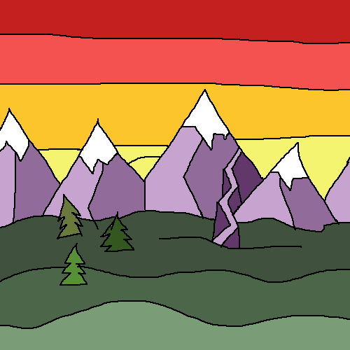

### Junior Web Developer
***
 

  
</a>

  <a href="https://www.linkedin.com/in/sarah-reimann/">
  
  

  
  

  
  

# Sarah Reimann

### :woman_technologist: About me:
- :telescope: I’m in school to become a full stack web developer
  * I've learned Javascript, C#, and React
  * I'm interested in design! 

- :seedling: Exploring functioning programming and UI design

- :zap: In my free time, I read murder mysteries, make art, and I run for fun

### How to reach me:
* reimannsarah45@gmail.com

<!--
**reimannsarah/reimannsarah** is a ✨ _special_ ✨ repository because its `README.md` (this file) appears on your GitHub profile.

Here are some ideas to get you started:

- 🔭 I’m currently working on ...
- 🌱 I’m currently learning ...
- 👯 I’m looking to collaborate on ...
- 🤔 I’m looking for help with ...
- 💬 Ask me about ...
- 📫 How to reach me: ...
- 😄 Pronouns: ...
- ⚡ Fun fact: ...
-->
